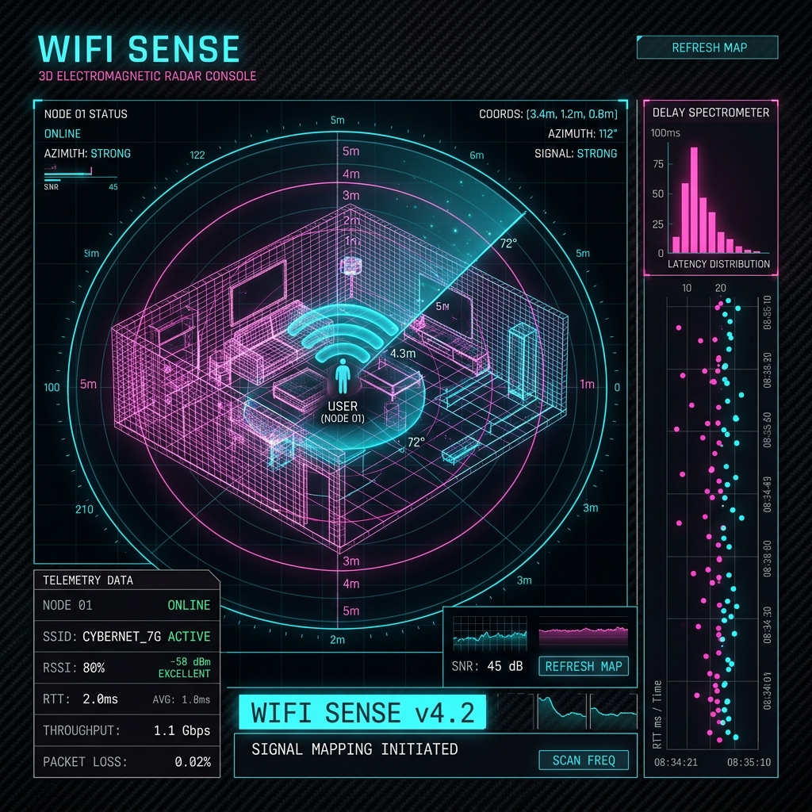

# 📡 Wifi Sense
> **3D Electromagnetic Multipath Radar, Wave Oscilloscope, and Wireless Packet Analyzer Console**

---



---

## 🌌 Overview
**Wifi Sense** is a low-level wireless electromagnetic packet analyzer and high-frequency radio wave perturbation sensor written in Python. Since standard operating systems lock down low-level Channel State Information (CSI) phase data, **Wifi Sense** utilizes high-fidelity mathematical proxy metrics (High-Frequency RSSI Sampling and Round-Trip-Time Jitter) mapped to a **3D perspective projection radar coordinate system** and a **1D delay spectrometer** to detect wave reflections, multipath fading anomalies, and physical environmental movements.

By combining connected-component analysis with **Polar Grid DBSCAN (Density-Based Spatial Clustering)**, it identifies repeating echoes bouncing off static obstacles, dynamically "uniting" them as glowing curved 3D holographic wireframe meshes (Echo Walls) in the 3D Radar Scope.

---

## ⚡ Key Capabilities

*   🔌 **Programmatic Wifi Orchestration**: Automatic scanning of surrounding networks and individual BSSID channels, registration of dynamic WPA2-PSK/Open XML profiles, and link health diagnosis using Windows `netsh`.
*   🚀 **High-Frequency Wave Sensing**: Rapid telemetry polling (up to 50 Hz) tracking amplitude fading (RSSI) and delay spreads (RTT) to construct propagation envelopes.
*   🌋 **Seismological Anomaly Trigger**: Short-Term Average / Long-Term Average (STA/LTA) ratio calculations to flag physical movements or sudden path blockages when deviations exceed the 8% fluctuation threshold.
*   📡 **Holographic 3D Echo Walls**: Advanced spatial clustering (PGDC) to group repeating reflection coordinates into physical curved wall segments consisting of a Top Spine, Bottom Spine, Vertical Ribs, and Diagonal Bracing Trusses.
*   📊 **1D Delay Spectrometer**: Multi-dimensional coordinate-calibrated tracking (0.0m to 6.0m):
    *   *Density Histogram*: Counts and categorizes distance reflections in 0.1m intervals.
    *   *Scrolling Time Waterfall*: Visualizes reflection ages (0s to 15s) with a dynamic color-fade path (Teal $\to$ Cyan $\to$ Purple $\to$ Deep Violet).
*   🕸️ **Low-Level Packet Dissector**: Real-time traffic sniffer powered by Scapy, parsing ARP, IP/IPv6, TCP, UDP, DNS, and ICMP frames with host breakdown reports.
*   🥊 **Active Medium Prober**: High-speed ping injection trains to evaluate channel jitter, loss, and diagnose multipath scattering under heavy loads.

---

## 🧠 Technical Concept & Math Model

### 1. Multipath Anomaly Detection (STA/LTA)
The engine maintains a sliding window of historical signal values. It calculates the ratio between the **Short-Term Average (STA)** (capturing instantaneous changes) and the **Long-Term Average (LTA)** (capturing stable ambient background signal strength):

$$\text{Ratio} = \frac{\text{Mean}(\text{window}_{\text{STA}})}{\text{Mean}(\text{window}_{\text{LTA}})} - 1.0$$

When the ratio exceeds the activation threshold ($\ge 0.08$), the system detects a **wave perturbation event** caused by physical path obstruction or reflection fluctuations.

### 2. Polar Grid Density Clustering (PGDC)
Instead of expensive DBSCAN operations over 1500 points in raw space at 30 FPS, **Wifi Sense** optimizes performance via connected components on a customized polar coordinate grid:
*   **Grid cell resolution**: $s_r = 0.15\text{ m}$ (distance bin) and $s_{\theta} = 0.20\text{ rad}$ ($\approx 11.5^\circ$ angular bin).
*   **Cyclical Shift Angle**: Computes the largest angular gap to shift angles cyclically:
    $$\theta_{\text{shifted}} = (\theta - \theta_{\text{split}}) \pmod{2\pi}$$
    This resolves the wrap-around boundary problem at $0 \to 2\pi$, ensuring curved structures aren't torn in half.
*   **Mesh Unification Threshold**: Groups with a density of $N \ge 12$ points formulate a stable wall segment, projecting top vertices at $Y = 15$ and bottom vertices at $Y = -15$.

---

## 💻 GUI Interface Guide

The visual dashboard features a three-canvas glassmorphic cyberpunk layout:

1.  **Electromagnetic Oscilloscope (Left)**: Simulates the primary carrier wave (neon teal) and the secondary multipath reflection wave (cyan/magenta). Perturbations insert live high-frequency noise and chaotic jitter spikes.
2.  **3D Radar Scope (Center)**: Renders the active reflection cloud in 3D perspective projection. Concentric circles define range thresholds (1m, 2m, 3m, 5m). Stable walls are drawn as glowing pink meshes with zigzag diagonal trusses, while emerging boundaries are rendered as cyan dashed wires.
3.  **1D Delay Spectrometer (Right)**: Renders the vertical depth histogram and a horizontal time waterfall. Displays peak labels synchronized with 3D centroids (e.g. `Peak: 2.1m (32 reps)`).
4.  **Calibration Panel (Far Right)**:
    *   *Sensing Rate Scale*: Fine-tunes high-frequency background polling loops (5 Hz to 50 Hz).
    *   *Noise Filter Scale*: Dynamically controls low-pass Exponential Moving Average ($\alpha \in [0.05, 1.0]$) smoothing.
    *   *Playback Control*: A dedicated master **PAUSE CAPTURE** button freezes scans instantly to isolate current telemetry readings.
    *   *Camera Presets*: Buttons to trigger Zoom (+/-), Reset camera, and toggle Auto-Rotate sweeping.

---

## 🛠️ Installation & Setup

### Prerequisites
1.  **OS**: Windows 10/11 (utilizes native `netsh` system calls).
2.  **Packet Injection Provider**: **Npcap** or **WinPcap** must be installed.
    *   *Download Npcap*: [https://npcap.com/](https://npcap.com/)
    *   *Important*: Ensure you select the checkbox **"Install Npcap in WinPcap API-compatible Mode"** during installation.
3.  **Python Environment**: Python 3.10+ is recommended.

### Installation
1.  Clone the repository and enter the directory:
    ```bash
    git clone https://github.com/yourusername/wifi_sense.git
    cd wifi_sense
    ```
2.  Install dependencies:
    ```bash
    pip install -r requirements.txt
    ```

---

## 🚀 Usage Guide

The application entry point is `run.py`, router-equipped with subcommands via Click:

### 1. Launch 3D Retro Cyber GUI
Opens the interactive three-canvas graphics HUD console:
```bash
python run.py gui
```

### 2. Scan Surrounding Channels
Performs a deep-plane scan of neighboring networks, compiling SSIDs, signal levels, bands, channels, and individual MAC addresses (BSSIDs):
```bash
python run.py scan
```

### 3. Connect Programmatically
Creates an XML profile on the fly and associates the system with the targeted wireless network:
```bash
python run.py connect --ssid "MyHomeWiFi" --password "secretKey123"
```
*(Omit the `--password` parameter for unsecured open access points).*

### 4. Query Link Health Status
Inspects the active wireless interface to output standard connection properties (current adapter, band, transmission speed, SSID, channel):
```bash
python run.py status
```

### 5. High-Frequency Signal Sensing
Starts a high-speed terminal polling loop to output real-time RSSI, RTT delays, jitter, path deviation metrics, and trigger alerts:
```bash
python run.py sense --duration 30 --interval 0.05
```

### 6. Low-Level Packet Sniffer
Dissects airwave packet frames passing through the adapter. Reveals protocol flows, source/destination coordinates, and captures volume breakdown statistics:
```bash
python run.py sniff --duration 20
```
*(Requires Administrator/Elevated privileges to bind raw socket capture interfaces).*

### 7. Active Medium Prober
Stimulates the channel by injecting UDP/ICMP load trains. Evaluates packet delivery rate and diagnoses channel quality:
```bash
python run.py probe --packets 150 --delay 0.01
```

---

## 🧪 Verification & Unit Testing

A robust, mock-equipped test suite is included in `tests/test_wifi_sense.py` verifying:
*   Dynamic XML profile builders for WPA2-PSK and Open networks.
*   Windows `netsh BSSID` output parser for nested channels and signal conversion.
*   Variance, mean, and standard deviation calculations.
*   STA/LTA seismological triggers under sudden network drops.
*   **PGDC Spatial Clustering Math**: Correct connected components clustering, noise rejection, and average centroid calculations.
*   **Multi-Cluster Separation**: Boundary distinction for multiple echoing walls located in different directions.

To run the test suite, execute:
```bash
python -m unittest tests/test_wifi_sense.py
```
**Output:**
```text
......
----------------------------------------------------------------------
Ran 6 tests in 0.087s

OK
```

---

## 📁 Project Architecture

```text
wifi_sense/
│
├── wifi_sense/                # Main package directory
│   ├── __init__.py            # Module declarations
│   ├── connection.py          # WLAN network association & status parser
│   ├── sensing.py             # Telemetry engine & anomaly tracking
│   ├── sniffer.py             # Scapy frame dissection & data logging
│   ├── prober.py              # UDP/ICMP packet prober & channel diagnoser
│   └── gui.py                 # Tkinter 3D radar scope & waves dashboard
│
├── tests/                     # Verification test modules
│   └── test_wifi_sense.py     # Automated unit tests
│
├── assets/                    # Graphical documentation resources
│   └── wifi_sense_radar.png   # 3D Radar UI Mockup
│
├── requirements.txt           # Python dependency listings
├── run.py                     # Command-line routing console
└── README.md                  # Comprehensive documentation
```

---

## 🎨 Theme & Cyber Aesthetics
*   **Console Palette**: Pure obsidian (`#0b0c10`), charcoal glass (`#1f2833`), vibrant teal (`#66fcf1`), bright cyan (`#00ccff`), and neon magenta/fuchsia (`#ff0055`).
*   **Typography**: Space Mono / Courier New, optimized for tabular alignment and telemetry grid readings.
*   **Micro-animations**: Dynamic border flashers pulsating red during alert warnings, fluid sine and noise wave simulations, and hardware-accelerated auto-rotation sweeps.
